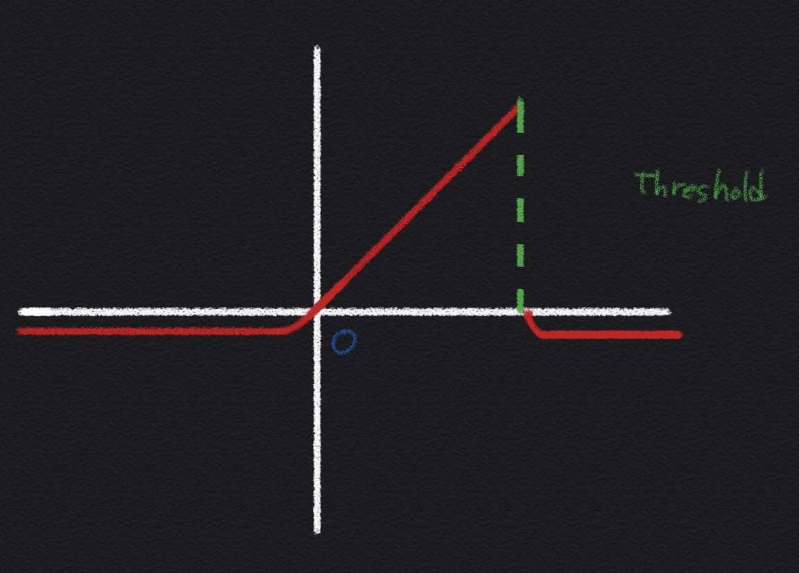

## Before Enter

The aELU function is not yet an official proven function.
This was inspired by  Sunnguk Cha's addition of Threshold to the ReLU function. You can see the solve the single perceptron XOR problem **[this](https://github.com/sunggukcha/xor)** link Mr.Sungguk Cha. With single perceptron and ReLU+threshold.
* * *

# Introduction
## RELU Issues

ReLU is obviously good activate function. But ReLU has a fatal drawback called the **["Dying ReLU"](https://medium.com/@danqing/a-practical-guide-to-relu-b83ca804f1f7)** phenomenon this phenomenon is "neurons always output zero".

This is why we say Dying ReLU.

Because the slope of ReLU in the negative range is also 0, once a neuron gets negative, it’s unlikely for it to recover. 
Such neurons are not playing any role in discriminating the input and is essentially useless. 
Lower learning rates often mitigates the problem. If not, leaky ReLU and ELU are also good alternatives to try. 
They have a slight slope in the negative range, thereby preventing the issue.

Therefore, I think, Mr.Sungguk Cha's ReaLU function is likely to have the same problem. If the ReLU has the same problem with Mr.Sungguk Cha ReaLU, I suggest that remove the disadvantages of the ReaLU function.

My suggest function uses relatively recent [ELU function](https://arxiv.org/abs/1511.07289) and uses threshold that apply like "ReaLU". However, it is also possible to change what comes after the threshold.
* * *

# aELU : almost Exponential Linear Unit
## More detail

The threshold gives the end point of the ELU function, and after the threshold, 
a last curve in the form of 

* * *
**{ exp ( threshold - input ) - 1 }** is made smooth. 
* * *

If function take the following form, 

* * *
**exp ( threshold - input )** before the last curve in the function.
* * *

It is placed on the x-axis not under the x-axis. 
And, it's going to be like [Leaky ReLU](https://arxiv.org/abs/1505.00853)'s Characteristics.

In this case, it is also possible to eliminate the calculation of the exponential function and multiply it by 

* * *
**( -1 * input * 0.001 )**
* * *

because the characteristics of the Leaky ReLU and the exponential function are similar. If so, it omits the complex calculation process of the exponential function, resulting in similar performance but faster calculation speeds.

And this is why can still possible to avoid the 'Dying ReLU' phenomenon. The reason is exponential function cannot be zero.



The function is implemented as Python like this 

```python
def aELU(z, threshold, alpha):
    if(z > threshold):
        return alpha * (np.exp(threshold-z) - 1) 
        # If you want more speed you can replace like this 
        # 
        # (z * 0.001) ~= (alpha * np.exp(threshold-z))
        # this is almost same in the graph 
    
    return z if z >= 0 else alpha * (np.exp(z) - 1)
```


### References

[1] https://github.com/sunggukcha/xor

[2] https://medium.com/@danqing/a-practical-guide-to-relu-b83ca804f1f7
