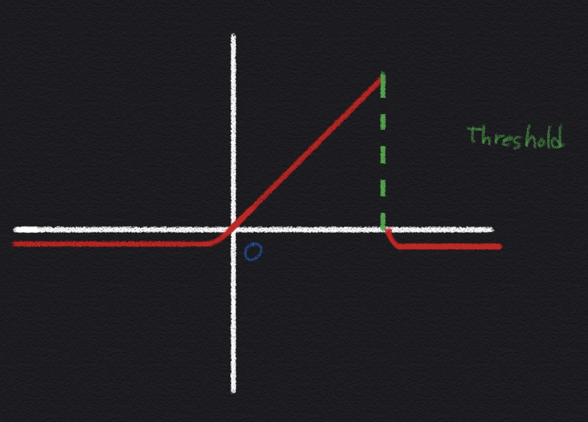
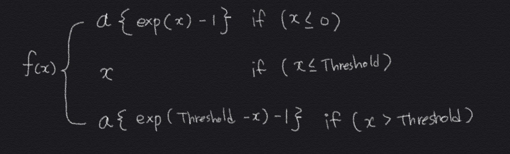

## 들어가기 전에

aELU 함수는 아직 공식적으로 검증되지 않았습니다.

이 함수는 Sunnguk Cha님의 ReaLU 함수에 영감을 받아 만들게되었으며, [이곳](https://github.com/sunggukcha/xor) 에서 볼 수 있듯이,

단일 퍼셉트론과 커스터마이징된 활성함수인 ReaLU만으로 XOR문제를 해결하였습니다. 
* * *

# 소개
## ReLU의 문제점. 그리고 ReaLU의 동일 문제에 대한 가능성.

ReLU는 좋은 함수임에는 틀림이 없습니다. 
하지만 ReLU는 치명적 단점인 '[Dying ReLU](https://medium.com/@danqing/a-practical-guide-to-relu-b83ca804f1f7)'라는 현상을 가지고 있는데요.
이 현상은 뉴런이 언제나 0을 내뱉는 것입니다. 이 현상 때문에 'Dying ReLU'라고 불리우죠.

"음의 범위에 입력값은 ReLU 함수의 기울기도 0이기 때문에, 일단 뉴런이 음이 되면, 회복될 가능성은 낮습니다. 
이렇게 되어버린 뉴런들은 입력을 구별하는데 아무런 역할을 하지 않으며 본질적으로 쓸모없습니다. 
이경우 0값이 되지 않는 Leaky ReLU 및 ELU도 시도해 볼 수 있는 좋은 대안입니다. 
해당 함수들은 음의 범위에서 경사가 약간 발생하여 문제가 발생하지 않습니다." -[참고](https://medium.com/@danqing/a-practical-guide-to-relu-b83ca804f1f7)

그러므로, 제 생각에 Sungguk Cha님의 ReaLU함수에서 ReaLU와 동일하거나 비슷한 현상이 올 가능성이 있다고 생각합니다.
만약, ReLU의 문제점이 ReaLU함수에 동일하게 나타난다면, 
저는 ReLU의 문제점을 극복한 [ELU](https://arxiv.org/abs/1511.07289) 함수에 임계값(Threshold)를 
ReaLU함수와 동일하게 넣은 aELU를 제안하고자 합니다. 해당 함수는 임계값 뒤에 나오는 비선형 함수 또는 선형함수로 바꾸어도 
'Dying ReLU' 현상이 발생하지 않을겁니다.

* * *

# aELU : almost Exponential Linear Unit
## 다 자세하게.

ELU 함수에 마지막에 임계값과 추가적인 함수를 넣는 방식으로 aELU는 설계되어있습니다.

임계값 뒤에 오는 커브는 [알파 * {지수함수(임계값 - 입력값) - 1}] 로 자연스럽게 내려가는 형식입니다.

만약에 임계함수 뒤에 오는 함수를 다음과 같은 형식으로 변경한다면 {알파 * 지수함수(임계값 - 입력값)} 

X좌표보다 위에 존재하게 되며, {알파 * 지수함수(임계값 - 입력값)} ~= (입력값 * 0.001) 이기 때문에

[Leaky ReLU](https://arxiv.org/abs/1505.00853)의 특성과 유사하게 보일 수도 있습니다.

이러한 특성을 이용하여, 지수함수의 연산을 하지 않고 (입력값 * 0.001)을 하여 연산량을 줄이고 속도를 얻을 수도 있습니다.

그리고 이렇게 변경을 하더라도, 지수함수의 값은 0이 될 수 없으며, 또한 기울기값이 0이 되지 않기 때문에 'Dying ReLU'의 현상을 피할 수 있습니다. 




다음 함수를 파이썬으로 옮기면 다음과 같아집니다.

```python
def aELU(z, threshold, alpha):
    if(z > threshold):
        return alpha * (np.exp(threshold-z) - 1) 
        # If you want more speed you can replace like this 
        # 
        # (z * 0.001) ~= (alpha * np.exp(threshold-z))
        # this is almost same in the graph 
    
    return z if z >= 0 else alpha * (np.exp(z) - 1)
```


### 참고

[1] https://github.com/sunggukcha/xor

[2] https://medium.com/@danqing/a-practical-guide-to-relu-b83ca804f1f7
